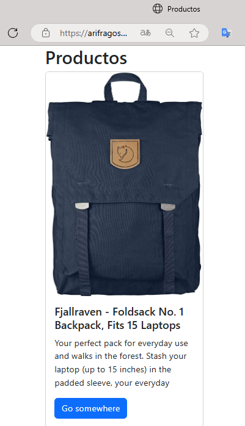

# CH53_Productos
## Ejercicio para hacer card con productos y su descripción 

Pasos para hacer:
```
- Se toma una IP con un array de objetos 
- Cada uno tiene su titulo, imagen, descripción, etc
- Se crea una función para tomar los datos con un .then para que se vean en pantalla o con un .catch si los datos fallan para que mende un mensaje de error 

- Tambien se crea otra función para que se visualicen los datos en una card cuando .then funcione correctamente 

```
>Vista previa del inex.html
